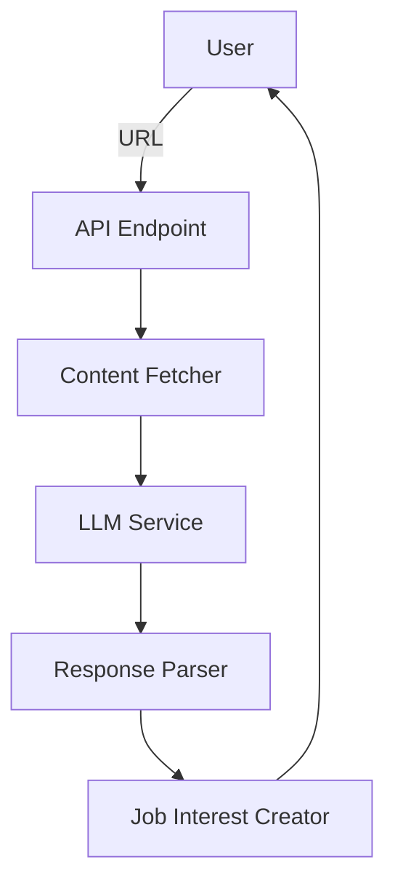
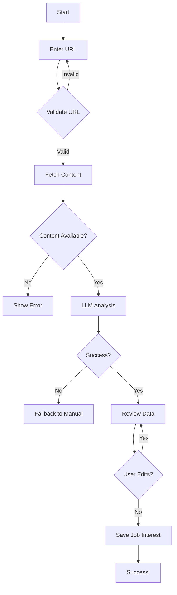

# Job Posting Scraping Feature

## Overview
A wizard-based interface for adding new job interests that can automatically extract structured job data from URLs using LLM-based analysis. The system fetches web content and uses large language models to intelligently parse and extract key job posting information.

## Features

### Step 1: URL Input
- Simple form with URL input field
- Validate URL format and security
- Submit button to trigger LLM analysis
- Loading state during processing
- LLM provider selection (when multiple available)

### Step 2: Content Fetching & LLM Processing
- Fetch web page content (HTML, text)
- Use LLM to analyze and extract structured data
- Support multiple extraction modes:
  - **Specific Mode**: Optimized for known job boards (LinkedIn, Indeed, etc.)
  - **Generic Mode**: Works with any job posting URL
- Handle rate limits and API errors gracefully
- Timeout and progress tracking

### Step 3: Data Extraction
Extract the following fields when available:
- **Company Name**
- **Position Title**
- **Job Description** (cleaned text)
- **Location** (remote/hybrid/on-site)
- **Work Model** (remote, hybrid, on-site)
- **Salary Range** (min/max with currency)
- **Job Posting Date**
- **Application Deadline**
- **Required Skills/Qualifications** (structured list)
- **Benefits** (structured list)
- **Seniority Level**
- **Employment Type** (full-time, part-time, contract)

### Step 4: Review & Edit
- Display extracted data in editable form
- Allow user to review and correct any field
- Confidence indicators for LLM-extracted data
- Manual override capability for all fields
- Preview of final job interest

### Step 5: Save
- Create job interest record with extracted data
- Option to immediately convert to application
- Success confirmation with extracted data summary
- Feedback option to improve LLM accuracy

## Technical Implementation

### Backend Architecture



### Core Components

1. **LLM Service Integration**:
   - Elixir LLM abstraction library (e.g., `exllama`, `bumblebee`, or custom)
   - Multiple provider support (OpenAI, Anthropic, local models)
   - API token management and security
   - Rate limiting and circuit breakers

2. **Content Fetcher**:
   - HTTP client with timeout and retry logic
   - Basic HTML parsing for text extraction
   - JavaScript rendering fallback (optional)
   - Security headers and URL validation

3. **Prompt Engineering**:
   - Job board-specific prompt templates
   - Generic web page analysis prompts
   - Structured output formatting
   - Error handling and retry prompts

4. **API Endpoint**:
   - `POST /api/scrape_job`
   - Parameters: URL, mode (specific/generic), provider preference
   - Returns: Structured JSON with extracted data and confidence scores
   - Authentication: Requires valid session

### Data Structure

```elixir
%{
  url: "https://www.linkedin.com/jobs/view/123456789",
  source: "linkedin",
  extraction_mode: "specific",
  confidence_score: 0.92,
  
  company_name: %{
    value: "Tech Corp Inc",
    confidence: 0.98
  },
  
  position_title: %{
    value: "Senior Software Engineer",
    confidence: 0.95
  },
  
  job_description: %{
    value: "We're looking for an experienced...",
    confidence: 0.88,
    original_length: 1245,
    cleaned_length: 1187
  },
  
  location: %{
    value: "San Francisco, CA",
    work_model: "hybrid",
    confidence: 0.90
  },
  
  salary: %{
    min: 120000,
    max: 150000,
    currency: "USD",
    period: "yearly",
    confidence: 0.85
  },
  
  skills: [
    %{name: "Elixir", confidence: 0.95},
    %{name: "Phoenix", confidence: 0.92},
    %{name: "PostgreSQL", confidence: 0.88}
  ],
  
  metadata: %{
    posting_date: "2024-03-15",
    application_deadline: nil,
    employment_type: "full_time",
    seniority_level: "senior"
  },
  
  raw_content: "<html>...</html>",
  processing_time_ms: 2450,
  llm_provider: "openai",
  llm_model: "gpt-4-turbo"
}
```

## Extraction Modes

### Specific Mode (Job Board Optimized)
- **Target**: Known job boards with structured data
- **Approach**: Board-specific prompts and parsing
- **Examples**: LinkedIn, Indeed, Glassdoor, AngelList
- **Accuracy**: High (90-98%)
- **Speed**: Fast (1-3 seconds)

### Generic Mode (Universal Web Page)
- **Target**: Any job posting URL
- **Approach**: General web page analysis with LLM
- **Examples**: Company career pages, niche job boards
- **Accuracy**: Medium (75-90%)
- **Speed**: Medium (2-5 seconds)

### Manual Fallback Mode
- **Trigger**: LLM failure, unsupported content, user request
- **Approach**: Pre-fill form with URL, user enters all data
- **Accuracy**: 100% (user-provided)
- **Speed**: N/A

## LLM Integration Strategy

### Provider Support
1. **OpenAI** (GPT-4, GPT-3.5)
2. **Anthropic** (Claude 3)
3. **Local Models** (via Ollama, LM Studio)
4. **Mistral** (Mistral AI models)
5. **Google** (Gemini models)

### Configuration
- Environment variables for API keys
- Runtime configuration for model selection
- User-specific token management (future)
- Fallback chain between providers

### Prompt Design
```
SYSTEM: You are a job posting analysis expert. Extract structured information from the following job posting content. Return only JSON with the specified fields. If information is not available, use null values.

USER: 
Content: [WEB_PAGE_CONTENT]
Mode: [specific|generic]
Source: [job_board_name|unknown]

Expected fields: company_name, position_title, job_description, location, work_model, salary_min, salary_max, skills, posting_date, employment_type

ASSISTANT: {
  "company_name": "...",
  "position_title": "...",
  ...
}
```

## User Experience Flow



## Error Handling & Fallback

### Error Scenarios
1. **Invalid URL**: Clear validation message
2. **Unreachable URL**: Network error with retry option
3. **LLM API Failure**: Fallback to alternative provider or manual mode
4. **Rate Limited**: Exponential backoff with user notification
5. **Low Confidence**: Highlight uncertain fields for user review
6. **Content Too Long**: Truncate with warning and option to process anyway

### Fallback Strategy
```
Primary LLM Provider → Secondary LLM Provider → Manual Mode
↑                                      ↓
Retry with adjusted parameters   User Notification
```

## Security Considerations

### URL Processing
- **SSRF Protection**: Domain whitelisting and validation
- **Content Sanitization**: Clean HTML before LLM processing
- **Rate Limiting**: Prevent abuse and API cost overruns
- **Timeout**: Prevent hanging requests (30s max)

### API Security
- **Token Management**: Secure storage of LLM API keys
- **Request Signing**: Validate all LLM API requests
- **Usage Tracking**: Monitor and limit LLM token usage
- **Cost Controls**: Set maximum spend limits

### Data Privacy
- **Content Storage**: Temporary cache with auto-expiry
- **User Data**: No PII sent to LLM providers
- **Logging**: Minimal logging of sensitive data

## Configuration & Environment

### Required Configuration
```elixir
config :clientats, :llm,
  primary_provider: :openai,
  fallback_providers: [:anthropic, :local],
  openai_api_key: System.get_env("OPENAI_API_KEY"),
  anthropic_api_key: System.get_env("ANTHROPIC_API_KEY"),
  default_model: "gpt-4-turbo",
  timeout_ms: 30_000,
  max_retries: 3,
  max_content_length: 10_000
```

### Environment Variables
```bash
# LLM Configuration
OPENAI_API_KEY=sk-...
ANTHROPIC_API_KEY=sk-...
MISTRAL_API_KEY=sk-...

# Rate Limits
MAX_LLM_REQUESTS_PER_MINUTE=60
MAX_CONTENT_LENGTH=10000

# Fallback Settings
ENABLE_MANUAL_FALLBACK=true
FALLBACK_PROVIDER_CHAIN=openai,anthropic,local
```

## Performance Optimization

### Caching Strategy
- **Content Cache**: Store fetched HTML for 24h
- **LLM Response Cache**: Cache successful extractions for 7 days
- **Prompt Template Cache**: Compile and cache prompts

### Performance Targets
- **Specific Mode**: < 2s average response time
- **Generic Mode**: < 4s average response time
- **Error Rate**: < 5% of requests
- **Cost**: < $0.01 per successful extraction

## Future Enhancements

### Phase 2 Features
- **Browser Extension**: One-click job import
- **Email Parsing**: Extract jobs from email content
- **PDF/Document Support**: Parse uploaded job documents
- **Batch Processing**: Import multiple jobs at once
- **Job Matching**: Compare with user profile/skills

### Advanced Features
- **Multi-language Support**: Non-English job postings
- **Resume Matching**: Score job fit against user resume
- **Salary Benchmarking**: Compare with market rates
- **Company Research**: Auto-gather company info
- **Interview Prep**: Generate questions based on job description

### Technical Improvements
- **Local LLM Support**: Run models on-premise
- **Fine-tuned Models**: Domain-specific LLM training
- **Prompt Optimization**: A/B test prompt effectiveness
- **Cost Monitoring**: Real-time usage tracking
- **Provider Auto-selection**: Choose best provider per request

## Implementation Roadmap

### Phase 1: Core Functionality (Current Focus)
1. ✅ Research Elixir LLM libraries
2. 🔄 LLM service integration with token management
3. 🔄 Job scraping service with LLM extraction
4. 🔄 REST API endpoint implementation
5. 🔄 Error handling and fallback mechanisms
6. 🔄 Configuration and environment setup
7. 🔄 Basic tests and validation

### Phase 2: UI Integration
8. 🔄 Wizard UI for job URL import
9. 🔄 Progress indicators and user feedback
10. 🔄 Data review and editing interface
11. 🔄 Integration with existing job interest flow

### Phase 3: Optimization
12. Performance tuning and caching
13. Cost optimization strategies
14. Advanced error recovery
15. Monitoring and analytics

## Success Metrics

- **Accuracy**: > 90% for specific mode, > 80% for generic mode
- **User Adoption**: > 60% of job interests created via URL import
- **Performance**: < 3s average response time
- **Reliability**: < 2% failure rate with fallbacks
- **Cost**: < $0.005 per extraction at scale

## Monitoring & Analytics

### Key Metrics to Track
- Extraction success/failure rates
- Average processing time
- LLM token usage and costs
- User edit rates (accuracy indicator)
- Fallback frequency and reasons
- Provider performance comparison

### Alerting
- High error rates
- API key expiration
- Unusual usage patterns
- Cost threshold breaches
